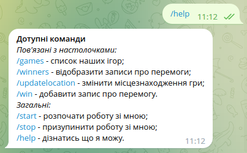
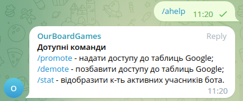
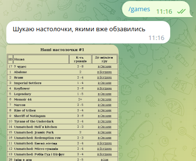
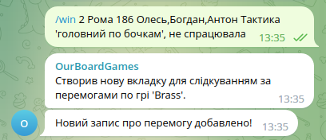
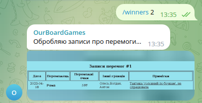

<!-- back to top link -->
<a name="readme-top"></a>

<!-- PROJECT LOGO -->
<br />
<div align="center">
  <a href="https://github.com/AntonFedoruk/boardgames-googlesheet-tgbot">
    
  </a>

<h3 align="center">Board Games Google Sheets Telegram Bot</h3>
<h4 align="center">[OurBoardGames](https://t.me/boardgames_googlesheet_bot)</h3>
</div>


<!-- TABLE OF CONTENTS -->
<details>
  <summary>Table of Contents</summary>
  <ol>
    <li>
      <a href="#about-the-project">About The Project</a>
      <ul>
        <li><a href="#built-with">Built With</a></li>
      </ul>
    </li>
    <li>
      <a href="#getting-started">Getting Started</a>
      <ul>
        <li><a href="#prerequisites">Required Software</a></li>
        <li><a href="#installation">Running</a></li>
      </ul>
    </li>
    <li><a href="#usage">Usage</a></li>
    <li><a href="#release-notes">Release Notes</a></li>
    <li><a href="#contributing">Contributing</a></li>
    <li><a href="#license">License</a></li>
    <li><a href="#contact">Contact</a></li>
    <li><a href="#acknowledgments">Acknowledgments</a></li>
  </ol>
</details>


<!-- ABOUT THE PROJECT -->
## About The Project
This project is a MVP of telegram bot that make it easy for users to work with their "Board games" Google Sheet.
Users can view their game list, edit it and leave records of their victory.
<p align="right">(<a href="#readme-top">back to top</a>)</p>


<!-- BUILT WITH -->
### Built With
* [![Docker][Docker]][Docker-url]
* [![Spring-Boot][Spring-Boot]][Spring-Boot-url]
* [![Thymeleaf][Thymeleaf]][Thymeleaf-url]
* [![Maven][Maven]][Maven-url]
* [![MySQL][MySQL]][MySQL-url]
* [![JUnit][JUnit]][JUnit-url]
* [![Telegram][Telegram]][Telegram-url]
* [![Google-Sheets][Google-Sheets]][Google-Sheets-url]

<p align="right">(<a href="#readme-top">back to top</a>)</p>


<!-- GETTING STARTED -->
## Getting Started
### Required Software
* terminal for running bash scripts
* git
* maven
* docker
* docker-compose

### Installation
1. Clone the repo:
   ```sh
   git clone https://github.com/AntonFedoruk/boardgames-googlesheet-tgbot.git
   ```
2. Run bash script:
   ```sh
   bash start.sh bot_username bot_token spreadsheets_id
   ```
3. Visit [google sign in page](http://localhost:8090/googlesignin) to gat access to Google Sheets.
4. Check the amount of games that have been found [here](http://localhost:8090/games), it should be more than 55.

<p align="right">(<a href="#readme-top">back to top</a>)</p>


<!-- USAGE EXAMPLES -->
## Usage

First of all, once <a href="#installation">installation</a> process been completed, you should add
[@boardgames_googlesheet_bot](https://t.me/boardgames_googlesheet_bot) to your chat. Once it's done each person who
would like to use it should enter <i><b>/start</b></i> command(it will help to promote user with access to modify Google
tables
in future). To get basic information how to maintain with bot, please enter <i><b>/help</b></i> command as showed below:
<div align="center">
    
</div>

[I](https://t.me/antonfedoruk) am an administrator of this bot by default, and this role gives additional rights to 
promote/demote users. Here is an example of admins commands:
<div align="center">
    
</div>

We have 3 main commands, witch are most useful for our needs:
* <i><b>/games</i></b>: this command displays the list of games that were found in Google Sheets;
<div align="center">
    
</div>

* <i><b>/win</i></b>: this command allows you to add a win record for a certain game;
<div align="center">
    
</div>

* <i><b>/winners</i></b>: this command displays the win records for the corresponding game.
<div align="center">
    
</div>
<p align="right">(<a href="#readme-top">back to top</a>)</p>


<!-- RELEASE NOTES -->
## Release Notes
Can be found in [RELEASE_NOTES](RELEASE_NOTES.md).


<!-- License -->
## License
This project is Apache License 2.0 - see the [LICENSE](LICENSE) file for details


<!-- Contact -->
## Contact
* Anton Fedoruk - [AntonFedoruk](https://github.com/AntonFedoruk)


<!-- CONTRIBUTING -->
## Contributing
Please, follow [Contributing](CONTRIBUTING.md) page.


<!-- CODE OF CONDUCT -->
## Code of Conduct
Please, follow [Code of Conduct](CODE_OF_CONDUCT.md) page.
<p align="right">(<a href="#readme-top">back to top</a>)</p>


<!-- ACKNOWLEDGMENTS -->

## Acknowledgments
* Example of real project structure:
    * [MVP TG bot](https://javarush.com/groups/posts/2935-java-proekt-ot-a-do-ja-pishem-realjhnihy-proekt-dlja-portfolio#articles) (
      SQL + Git + Docker)
* Design Patterns:
    * [Command Pattern](https://refactoring.guru/design-patterns/command)
    * [Decorator Pattern](https://refactoring.guru/design-patterns/decorator)
* Google API implementation:
    * [Interact with Google Sheets from Java](https://www.baeldung.com/google-sheets-java-client)
    * [Google Sheets Java quickstart](https://developers.google.com/sheets/api/quickstart/java)
    * [YouTube | Quick guide](https://www.youtube.com/watch?v=8yJrQk9ShPg) (1 video)
    * [YouTube | Google Drive API](https://www.youtube.com/watch?v=meoW_DG_QJE&list=PL6staZz89fj_sEJkcwATwSjKTENIkMCAl) (
      13 videos)
    * [YouTube | Advanced Oauth2](https://www.youtube.com/watch?v=n4eV7NH-p-I&list=PLSvyRHmxcfepRR2McW4vbxt-gHeC6KuVy) (
      3 videos)
* Docker's nuances:
    * [Xvfb & Docker - cannot open display](https://stackoverflow.com/questions/32151043/xvfb-docker-cannot-open-display)
    * [AWTError reason](https://medium.com/@pigiuz/hw-accelerated-gui-apps-on-docker-7fd424fe813e) (GUI apps on Docker)
* Logging:
    * [Spring Boot Logging](https://www.youtube.com/watch?v=8AN58dHzkz4) (1 video)
    * [Mapped Diagnostic Contexts (MDC)](https://logback.qos.ch/manual/mdc.html)
    * [Logback Layouts](https://logback.qos.ch/manual/layouts.html)
* Readme:
    * [Best-README-Template](https://github.com/othneildrew/Best-README-Template)
    * [Custom Readme Badges for GitHub](https://www.youtube.com/watch?v=qw3nRdcpZHw) (1 video)
        * [ShieldsIO](https://shields.io/)
        * [Simple Icons](https://simpleicons.org/?q=docker)

<p align="right">(<a href="#readme-top">back to top</a>)</p>


<!-- MARKDOWN LINKS & IMAGES -->
<!-- https://www.markdownguide.org/basic-syntax/#reference-style-links -->
[Docker]: https://img.shields.io/badge/Docker-2496ED?style=for-the-badge&logo=docker&logoColor=white
[Docker-url]: https://www.docker.com/
[Spring-Boot]: https://img.shields.io/badge/Spring_Boot-6DB33F?style=for-the-badge&logo=spring-boot&logoColor=white
[Spring-Boot-url]: https://spring.io/projects/spring-boot
[Thymeleaf]: https://img.shields.io/badge/Thymeleaf-005F0F?style=for-the-badge&logo=thymeleaf&logoColor=white
[Thymeleaf-url]: https://www.thymeleaf.org/
[Maven]: https://img.shields.io/badge/Maven-C71A36?style=for-the-badge&logo=apache-maven&logoColor=white
[Maven-url]: https://maven.apache.org/
[MySQL]: https://img.shields.io/badge/MySQL-4479A1?style=for-the-badge&logo=mysql&logoColor=white
[MySQL-url]: https://www.mysql.com/
[JUnit]: https://img.shields.io/badge/JUnit-25A162?style=for-the-badge&logo=junit5&logoColor=white
[JUnit-url]: https://junit.org/junit5/
[Telegram]: https://img.shields.io/badge/Telegram-API-26A5E4?style=for-the-badge&logo=telegram&logoColor=white
[Telegram-url]: https://core.telegram.org/bots/api
[Google-Sheets]: https://img.shields.io/badge/Google_Sheets-API-34A853?style=for-the-badge&logo=googlesheets&logoColor=white
[Google-Sheets-url]: https://developers.google.com/sheets/api/quickstart/java

[link text](#readme-top)

<a href="#about-the-project">About The Project</a>

<a href="#readme-top">readme top</a>